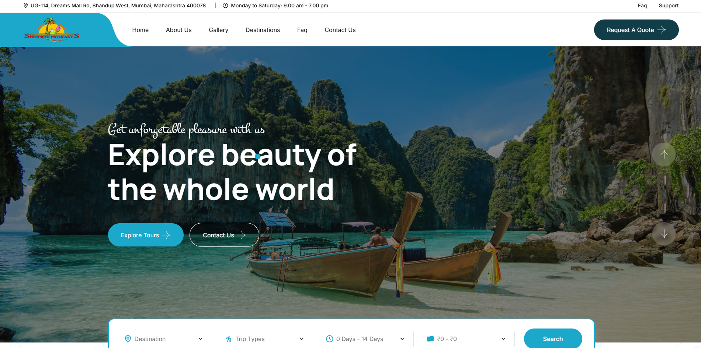

# Shivneri Holidays

**Client:** Shivneri Holidays  
**Website:** [shivneriholidays.com](https://shivneriholidays.com)  
**Industry:** Travel & Tourism  
**Technology Stack:** PHP, MySQL, WordPress, WooCommerce, Elementor, Astra Theme  

---

### 📝 Overview

Shivneri Holidays, a well-known Mumbai-based tour and travel company, approached us to develop a colorful and user-friendly digital platform that showcases the richness of their India tour packages. With offerings ranging from cultural and heritage tours to wildlife and adventure getaways, they needed a website that promotes their services and simplifies bookings.

---
### ⚠️ The Challenge

Although Shivneri Holidays had a strong offline reputation, their online presence lacked the visual appeal and functionality required to thrive in the competitive travel industry. Key issues included:

- ❌ Outdated and unengaging UI/UX  
- ❌ Poor structure for showcasing diverse tour offerings  
- ❌ Inability to easily update content or manage bookings  
- ❌ No e-commerce integration for tour bookings  
- ❌ Poor mobile responsiveness and performance limitations  

---
### 🎨 Design & Development Approach

Our mission was to transform their website into a visually captivating, high-performance, and conversion-focused travel portal. Here's how we approached it:

#### ✅ Strategy & Planning

- Aligned with the client’s vision and unique value propositions  
- Designed user journeys that prioritize clarity and ease of navigation  
- Structured content to give visibility to all package types  

#### 🖌️ UI/UX Design

- Used **Astra Theme** for speed, performance, and flexibility  
- Customized layouts with **Elementor** for a clean, modern interface  
- Focused on **visual storytelling** with high-quality imagery and clear CTAs  
- Designed to be fully **mobile-responsive** for travelers on the go  

#### ⚙️ Development

- Built on **WordPress** for streamlined content management  
- Integrated **WooCommerce** to facilitate seamless tour bookings  
- Organized content into categories: North India, South India, Heritage Tours, Wildlife Tours, etc.  
- Optimized for **speed and SEO** to boost discoverability  

---
### 🚀 Outcome

- ✅ **Increased Engagement**: Improved time on site and reduced bounce rates  
- ✅ **Simplified Booking Process**: Notable rise in inquiries and tour bookings post-launch  
- ✅ **Mobile-First Design**: Flawless performance across all devices  
- ✅ **Easy Management**: Empowered the Shivneri team to update and manage offerings without technical help  
